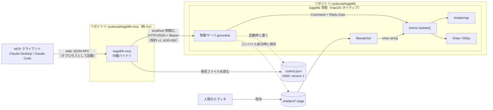

# ADR-005: MCP のプロセス構成 — 常駐 GUI ＋ 別リポジトリの中継バイナリ `kagelife-mcp`

**ステータス**: Accepted
**日付**: 2026-09-30
**決定者**: cyokozai
**関連**: ADR-001（単一バイナリ）、ADR-002（channel による受け渡し）、ADR-006（制御口 v1）、ADR-007（SDK）、assumptions-20260930 #3

---

## コンテキスト

LLM（Claude Desktop / Claude Code）が Kage シェーダを操作できるよう、KageLife に MCP サーバを足す。
stdio 方式の MCP サーバは、MCP クライアントが子プロセスとして起動する。
クライアントを終了すると stdin が閉じ、そのプロセスも終わる。
VJ の本番中にクライアントを再起動すると映像が落ちる構成は取れない。

また、Claude Code は stdio サーバを自動で再接続しない。
2026-04-18 の合意（assumptions #1）は「単一バイナリ、サーバー不要」、（#8）は「外部依存は Go 標準 + Ebitengine + fsnotify のみ」だった。

## 検討した選択肢

### 選択肢 A: 同居（GUI プロセスが stdio MCP を兼ねる）
**概要**: MCP クライアントが `kagelife` を直接起動し、そのプロセスがウィンドウも描く。
**メリット**:
- 最も簡単。プロセス間通信が要らない
**デメリット**:
- クライアントを終えると描画も止まる（本番で致命的）
- ウィンドウの作業ディレクトリがクライアント任せになる（`shaders/` は相対パスで読む）
- 演者が GUI を先に立ち上げておく運用ができない

### 選択肢 B: 常駐 GUI ＋ 中継プロセス
**概要**: 演者が `kagelife` を常駐させる。MCP クライアントは中継プロセスを起動し、
それが stdio の JSON-RPC を受けて、GUI の localhost 制御口（HTTP/JSON、ADR-006）へ中継する。
**メリット**:
- クライアントが落ちても映像は続く
- GUI は演者がリポジトリのルートで起動するので、作業ディレクトリが安定する
**デメリット**:
- 制御口という新しい待受点ができる（安全対策が要る → ADR-006）
- GUI が起動していないと、大半のツールは失敗する

中継プロセスの置き場所で、さらに 2 案に分かれる。

#### B-1: 同じバイナリのサブコマンド（`kagelife mcp`）
- 配布物は 1 つのまま（ADR-001 の「単一バイナリ」をそのまま守れる）
- ただし go-sdk とその間接依存が kagelife 本体に入る。中継側は ebiten を使わないのに、cgo と ebiten を含むバイナリとしてビルドされる
- 本体と MCP 側の公開・リリースの周期が一緒になる

#### B-2: 別リポジトリの別バイナリ（`cyokozai/kagelife-mcp` の `kagelife-mcp`）
- kagelife 本体の依存を ebiten / fsnotify / x/image のまま保てる（ADR-007）
- MCP 側は cgo も ebiten も要らない純 Go で、クロスビルドと CI が軽い
- MCP のプロセスが ebiten を初期化しない（macOS のメインスレッドへの配慮）
- 公開・リリースの周期を分けられる
- 代償: 配布物が 2 つになる。リポジトリをまたいで制御口の契約を守る必要がある。両者を結合した E2E テストがリポジトリをまたぐ

### 選択肢 C: ファイルだけ（MCP は `shaders/` に書き込むだけ）
**概要**: 既存の fsnotify 経路をそのまま使う。
**メリット**:
- GUI 側の変更が要らない
**デメリット**:
- コンパイル結果・状態・BPM を LLM に返せない。LLM はエラーを読んで直すことも、拍に合わせてフェードすることもできない
- 共演者としては力不足

## 決定

**選択肢 B-2（常駐 GUI ＋ 別リポジトリ `cyokozai/kagelife-mcp` の別バイナリ `kagelife-mcp`）を採用する。** `kagelife mcp` サブコマンドは作らない。

（2026-09-30 の前提合意では当初 B-1 を採っていたが、同日のユーザー判断で B-2 に変えた。assumptions-20260930「変更の記録」）

### 理由
- 本番中にクライアントの都合で映像が落ちない構成は B だけである
- C では US-2（エラーを読んで直す）と US-3（状態を読んでフェード）を満たせない
- A の簡単さは、描画停止の危険と引き換えにできない
- B-1 と B-2 では、本体の依存を増やさず、MCP 側を純 Go で軽く回せる B-2 を取る。配布物が 2 つになる代償は、制御口の契約を 1 か所（ADR-006）に固定し、発見ファイルの `version` で食い違いを検出することで抑える

### 運用上の取り決め
- 起動順は **GUI が先**。演者がリポジトリのルートで `kagelife` を起動し、その後で MCP クライアントが `kagelife-mcp` を起動する
- `kagelife-mcp` は **ツール呼び出しのたびに発見ファイルを読み直す**。GUI を再起動してポートとトークンが変わっても、MCP クライアント側の再接続は要らない（Claude Code が stdio サーバを自動再接続しないことへの対策）
- 発見ファイルの `version` が 1 以外なら、`kagelife-mcp` は接続せず `isError` で版の食い違いを返す（ADR-006）
- GUI に届かないとき（発見ファイルが無い、接続拒否、タイムアウト、2xx 以外）は、ツールの結果を `isError` 付きで返す。`get_kage_guide` は GUI 無しでも答える
- `kagelife-mcp` の stdout は JSON-RPC 専用とし、ログは stderr に出す
- stdin が EOF になったら `kagelife-mcp` は正常終了する。GUI には何も起きない
- 契約の正典は kagelife の ADR-006 に置く。kagelife-mcp リポジトリは契約を複製せず、ADR-006 を参照する

### 前提条件
- GUI は macOS ホストでネイティブに動かす（assumptions-20260930 #2）
- PoC: go-sdk v1.8.0 の stdio サーバで、接続拒否・タイムアウトが `isError` で LLM に返ること、stdin EOF で正常終了することを確認済み（11 テスト、`-race` で PASS）。PoC は ebiten を含まない単独のモジュールで動かした

## 影響・結果

**ポジティブ**:
- MCP クライアントの障害が描画に波及しない
- kagelife 本体の依存と、ビルド・CI の条件（cgo、X11 のヘッダ）が変わらない
- `kagelife-mcp` は cgo 無しでクロスビルドでき、CI が軽い

**ネガティブ**:
- ADR-001 と assumptions-20260418 #1 の「サーバー不要」を、localhost 限定の制御口の分だけ緩める
- 配布物が 2 つになる（`kagelife` と `kagelife-mcp`）
- 制御口の契約をリポジトリをまたいで守る必要がある。結合した E2E テストはリポジトリをまたぐ
- GUI の異常終了で発見ファイルが残ることがある（`pid` を載せ、接続拒否は `isError` で返す）

**Action Items**:
- [ ] 制御口と発見ファイルを実装する（kagelife: feat/mcp-control-api、ADR-006）
- [ ] `kagelife-mcp` と 8 ツールを実装する（kagelife-mcp: feat/mcp-stdio-server、dev 向け）
- [ ] リポジトリをまたぐ E2E の手順を決める（macOS 実機で手動、が当面の想定）
- [ ] macOS 実機で、ウィンドウ最小化時にも制御口が応答するか確かめる（未確認）
