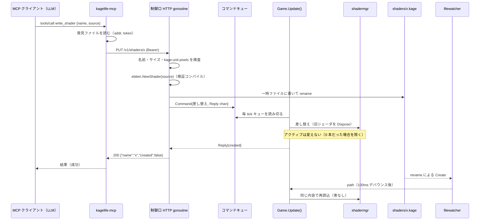
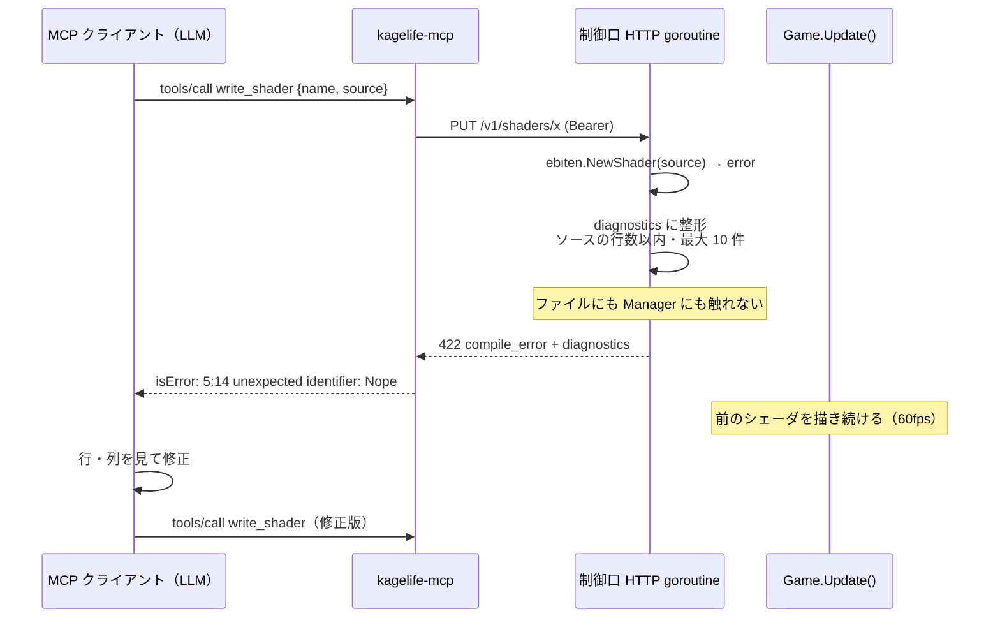

# ADR-006: 制御口 v1 の契約 — localhost HTTP/JSON ＋ Update キュー

**ステータス**: Accepted
**日付**: 2026-09-30（改訂: 2026-10-01。BPM の扱いを ADR-008 D3 に合わせた。PRD Q-008）
**決定者**: cyokozai
**関連**: ADR-002（fsnotify + buffered channel）、ADR-005（プロセス構成）、[ADR-008](ADR-008-crossfade-compositing.md)（クロスフェードと BPM の既定値・制限）、assumptions-20260930 #4 #5 #10

---

## コンテキスト

ADR-005 で、常駐 GUI（`cyokozai/kagelife`）の制御口へ、別リポジトリ `cyokozai/kagelife-mcp` の別バイナリ `kagelife-mcp` が中継する構成を採った。
kagelife の feat/mcp-control-api（GUI 側）と kagelife-mcp の feat/mcp-stdio-server（中継側）を並行して作るため、両者の共通仕様を先に固定する。
本 ADR の「契約」節を制御口 v1 の**正典**とする。契約はリポジトリをまたぐので、kagelife-mcp 側には複製せず本 ADR を参照させ、版の食い違いは発見ファイルの `version` で検出する。

設計上の制約:
- Ebitengine の `Image` の描画操作と `ReadPixels` は `Update` / `Draw` の中でしか安全に扱えない。`ebiten.NewShader` だけは別 goroutine からでも安全（PoC で確認。RunGame 前・別 goroutine からでも同期的にコンパイルし、`行:列: メッセージ` 形式のエラーを返す）
- 現状の `Update()` は watcher の `chan string`（容量 8）を 1 tick に 1 件だけ非ブロッキングで受け取る
- LLM が任意のコードを書く。制御口は同じマシンの他のプロセスからも届く

## 検討した選択肢

### 待受と認証
- **A: 127.0.0.1 限定 + 起動時トークン（採用）** — 他ホストからは届かない。同じマシンの他プロセスやブラウザも、トークンを知らなければ操作できない
- B: 127.0.0.1 限定・認証なし — 同じマシンのどのプロセスからでも書き込める。LLM が書くコードの経路としては緩すぎる
- C: Unix ドメインソケット — ファイル権限で守れるが、HTTP クライアントとテスト（`httptest`）の素直さを失う

### ゲームループへの渡し方
- **A: 返信チャネル付きコマンドを Update がキューから読み切る（採用）** — ADR-002 の「channel に一本化」の延長。mutex を使わない
- B: `sync.Mutex` で Manager を共有 — ADR-002 で退けたのと同じ理由（ループ内のロック待ちでフレームを落とす）で却下

### エラーの返し方
- **A: ソースの行の範囲内・最大 10 件に絞った diagnostics（採用）**
- B: Ebitengine のエラーをそのまま返す — 構文エラーは内部のブリッジコードを連結して解析されるため件数が膨らむ（PoC で 127 件の例）。範囲外の行は LLM には直しようがなく、会話の文脈を無駄に使う

## 決定

**127.0.0.1 限定・トークン認証の HTTP/JSON 制御口を置き、要求は返信チャネル付きのコマンドとして `Update()` がキューから読み切って処理する。以下の契約を v1 とする。**

---

## 契約（制御口 v1）

### 接続
- 待受: 127.0.0.1 のみ。GUI のフラグ `-control-addr`（既定 `127.0.0.1:0` = 空きポート）。ループバック以外を指定したら起動エラー（判定は IP リテラルだけ。補足 9）
- 発見ファイル: GUI 起動時に JSON を 0600 で書く
  ```json
  {"addr":"127.0.0.1:NNNNN","token":"<32バイト乱数の hex 64 文字>","pid":123,"shader_dir":"/abs/path/shaders","version":1}
  ```
  場所: 環境変数 `KAGELIFE_CONTROL_FILE`、無ければ `filepath.Join(os.UserCacheDir(), "kagelife", "control.json")`。GUI 正常終了時に削除（token が自分のものと一致するときだけ。補足 13）。`version` は 1 固定で、クライアントは 1 以外を受け付けない（補足 15）
- 認証: 全リクエストに `Authorization: Bearer <token>`。不一致・欠落は 401 `unauthorized`
- 形式: リクエスト・レスポンスとも `application/json`
- エラー共通形: `{"error":"<code>","message":"<人間/LLM 向けの説明>"}`（`compile_error` のみ `diagnostics` を追加）
- ゲームループが 2 秒以内に応答しなければ 503 `loop_timeout`
- 未定義パスは 404 `not_found`、メソッド違いは 405 `method_not_allowed`

### シェーダ名
- 正規表現 `^[a-z0-9][a-z0-9_-]{0,63}$`（拡張子なし）。ファイルは `<shader_dir>/<name>.kage`。違反は 400 `invalid_name`
- 既存ファイルの名前はファイル名から `.kage` を除いたもの（例: `01_uv`）
- パス区切り・`.` を含む名前は正規表現で弾かれるので、書き込みは `shaders/` 直下に限られる
- 名前検査は GET・PUT・switch・crossfade のすべてに適用し、エスケープはデコードしてから検査する（補足 3）

### エンドポイント

#### GET /v1/state
200:
```json
{"active":"01_uv","shaders":["01_uv","02_time_sin"],"bpm":120.0,"bpm_measured":false,
 "fade":{"fading":false,"target":"","mix":0.0,"beats":4.0},
 "fps":59.9,"resolution":[1280,720],
 "last_error":null}
```
`last_error` は `{"shader":"x","message":"..."}` または null（ファイル監視経由のコンパイル失敗も含む最新のもの。寿命は補足 8）。`active` はシェーダ 0 本なら `""`。
`bpm` は常に 40〜300 で、0（未設定）にはならない。タップ前は既定の 120（[ADR-008](ADR-008-crossfade-compositing.md) D3）。`bpm_measured` は、`bpm` が既定値のままなら false、タップまたは `POST /v1/bpm` で設定された値なら true（`tempo.Tapper.Measured()` に当たる）。

#### GET /v1/shaders/{name}
200 `{"name":"x","source":"..."}` / 404 `not_found`

#### PUT /v1/shaders/{name}
body `{"source":"..."}`。処理順:
1. 名前検査 → 400 `invalid_name`
2. 64KiB 超 → 413 `too_large`
3. `//kage:unit pixels` の行が無い → 422 `unit_pixels_required`
4. コンパイル（ファイルより先）。失敗 → ファイルに触れず 422:
   ```json
   {"error":"compile_error","message":"<整えた要約>","diagnostics":[{"line":5,"col":14,"message":"unexpected identifier: Nope"}]}
   ```
   - diagnostics はソースの行数以内のものだけ（Ebitengine は内部コードを連結して解析するため、範囲外の行は捨てる）。最大 10 件
   - 構文エラーは `errors.As(err, *scanner.ErrorList)` で取れる。意味エラーは文字列 `行:列: メッセージ`（改行区切り）を解析する。どちらにも当たらないものは `line=0,col=0` で message にそのまま入れる
5. 成功 → `<shader_dir>/<name>.kage` に書き込み（同ディレクトリの一時ファイル＋rename）、Manager で差し替え（無ければ末尾に追加）。
   200 `{"name":"x","created":true}`（新規なら true、既存の差し替えなら false。ファイル基準: 補足 7）
   直後に fsnotify 経由で同じファイルが再読込されても害が無いこと
   成功してもアクティブにはしない（0 本の状態を除く。補足 14）

#### POST /v1/switch
body `{"name":"x"}` → 200 `{"active":"x"}` / 404 `not_found`

#### POST /v1/crossfade
body `{"name":"x","beats":4}`（beats 省略時は現在の FadeBeats。指定時は 0 < beats <= 64）。
200 `{"target":"x","beats":4.0}` / 404 `not_found` / 400 `invalid_beats`。
BPM は常に 40〜300 で 0 にならないため、BPM を理由に失敗することはない（タップ前は既定の 120 BPM で進む。[ADR-008](ADR-008-crossfade-compositing.md) D3）。
判定順は 名前 400 → beats 400 → 未読込 404（補足 4）。beats 指定はプリセットを変えない（補足 5）。フェードしていない active への crossfade は何もせず 200（補足 6）

#### POST /v1/bpm
body `{"bpm":128}` → 40〜300 以外は 400 `invalid_bpm`。200 `{"bpm":128.0}`。
範囲はタップ BPM の制限と同じ（[ADR-008](ADR-008-crossfade-compositing.md) D3）。タップ BPM と共存する。以後のタップで上書きされてよい

### v1 の範囲外（後続 PR）
- `GET /v1/capture?max_width=1024&format=png|jpeg`（feat/mcp-capture-frame）
- `POST /v1/uniforms`、state への uniform 一覧（feat/mcp-uniform-params）

これらは v1 では 404 のままでよい。

### Kage の予約 uniform（GUI が毎フレーム渡す）
`Time float` / `Resolution vec2` / `Beat float`（拍内位相 0〜1） / `Cursor vec2` / `Frame int` / `Random float`

### エラーコード一覧

| HTTP | error | 発生条件 |
|------|-------|---------|
| 400 | `invalid_request` | JSON 本文が不正、または必須項目が欠けている |
| 400 | `invalid_name` | シェーダ名が正規表現に合わない（GET・PUT・switch・crossfade。エスケープはデコードしてから検査） |
| 400 | `invalid_beats` | beats が 0 以下または 64 超 |
| 400 | `invalid_bpm` | bpm が 40〜300 の外 |
| 401 | `unauthorized` | トークンの欠落・不一致 |
| 404 | `not_found` | シェーダが無い、または未定義パス |
| 405 | `method_not_allowed` | メソッド違い |
| 413 | `too_large` | ソースが 64KiB 超、または JSON 本文全体が 1MiB 超 |
| 422 | `unit_pixels_required` | `//kage:unit pixels` の行が無い |
| 422 | `compile_error` | コンパイル失敗（`diagnostics` 付き） |
| 500 | `internal_error` | ファイルの読み書きに失敗した |
| 503 | `loop_timeout` | ゲームループが 2 秒以内に応答しない |

### 補足（2026-09-30 確定）

feat/mcp-control-api の実装で確定した補足。本節と実装が食い違うときは実装を正とし、本節を直す。

1. **400 `invalid_request`**: JSON 本文が不正、または必須項目が欠けている
2. **500 `internal_error`**: ファイルの読み書きに失敗した
3. **名前検査の範囲**: 名前検査は PUT だけでなく、GET /v1/shaders/{name}、switch、crossfade の name にも適用する（400 `invalid_name`）。`..%2Fx` のようにエスケープされたものも、デコードしてから検査して 400 にする
4. **crossfade の判定順**: 名前検査 400 → beats 400 → 未読込 404（BPM は 0 にならないので BPM による失敗は無い。2026-10-01 改訂）
5. **beats とプリセット**: beats を指定した crossfade はプリセット（`[` `]` で変える拍数）を変えない。state の `fade.beats` は、指定付きのフェード中はその値、それ以外はプリセットの値を返す
6. **active への crossfade**: 今フェードしていない状態で active と同じシェーダへ crossfade すると何も起きない。それでも 200 を返す
7. **`created` の基準**: ファイル基準。rename の前にファイルが無ければ true
8. **`last_error` の寿命**: コンパイルに失敗するたびに上書きし、どのシェーダでも次にコンパイルが成功したら null に戻る。PUT の失敗も記録する。ただし、起動時の読み込みで失敗したシェーダは `last_error` に入らず、ログにだけ出る
9. **ループバックの判定**: IP リテラルだけで判定する（127.0.0.0/8 と ::1）。`localhost` や `0.0.0.0` は起動エラー
10. **範囲外だけの diagnostics**: diagnostics が全件ソースの行の範囲外のときは、先頭の 1 件を line 0 / col 0 として返す（空の配列にはしない）
11. **PUT の loop_timeout**: PUT が `loop_timeout` になった場合、ファイルは書き込み済みである。反映はファイル監視に任せる
12. **本文の上限**: JSON 本文全体の上限は 1MiB（413 `too_large`）。source 単体は 64KiB まで
13. **発見ファイルの削除**: 終了時の削除は、ファイルの中の token が自分のものと一致するときだけ行う（後から起動した別の GUI の発見ファイルを消さない）
14. **PUT とアクティブ**: PUT は成功してもアクティブにしない（切り替えは switch / crossfade で行う）。例外として、シェーダが 0 本の状態で PUT すると、その 1 本が表示される。Manager は常に index 0 を表示し、「何も表示しない」状態を持たないため
15. **発見ファイルの `version`**: 1 に固定する。クライアント（`kagelife-mcp`）は 1 以外を受け付けない

---

## MCP ツールとの対応

`kagelife-mcp`（リポジトリ `cyokozai/kagelife-mcp`）は次のように中継する。2xx 以外は `error` と `message`（`compile_error` なら `diagnostics` も）をテキストにして `isError` 付きで返し、LLM が読んで直せるようにする。

| ツール | 制御口 | 備考 |
|--------|--------|------|
| list_shaders | GET /v1/state | `shaders` と `active` を返す |
| read_shader | GET /v1/shaders/{name} | |
| write_shader | PUT /v1/shaders/{name} | 丸ごと置き換え |
| switch_shader | POST /v1/switch | |
| crossfade | POST /v1/crossfade | |
| set_bpm | POST /v1/bpm | |
| get_state | GET /v1/state | fps の低下で重いシェーダを知らせる |
| get_kage_guide | （呼ばない） | 言語の制約と予約 uniform を中継側が静的に返す。GUI 無しでも答える |
| capture_frame | GET /v1/capture | 後続（feat/mcp-capture-frame） |
| set_uniform | POST /v1/uniforms | 後続（feat/mcp-uniform-params） |

---

## シーケンス: write_shader

処理の置き場所の目安。コンパイル（`NewShader`）は別 goroutine でも安全なので HTTP goroutine で行い、
Manager の状態変更（差し替え・`Dispose`）は `Update()` の中だけで行う。

### 成功



### 失敗（コンパイルエラー）



---

## 理由

- **localhost 限定**: MVP にリモート操作の要件は無い。待受をループバックに閉じれば、ネットワーク越しの攻撃面が生じない
- **トークン認証**: 同じマシンの他プロセスやブラウザからの要求を、トークンを知る `kagelife-mcp` だけに絞る。発見ファイルは 0600 で、トークンは起動のたびに変わる
- **Update キュー（ADR-002 の延長）**: ゲームループの外から状態を変える経路を、fsnotify と同じく channel に一本化する。返信チャネルを付けることで、ファイル経路では返せなかった成否を呼び出し側に返せる。1 tick に 1 件だけ受ける形では要求が溜まると反映が遅れるので、キューは毎 tick 読み切る。PoC（Xvfb）ではこの構成でシェーダ差し替えの往復が 17ms だった
- **コンパイルが先、ファイルは後**: 失敗したコードで作品ファイルを壊さない。人間のエディタで開いているファイルも、成功したときにしか書き換わらない
- **`//kage:unit pixels` 必須**: v2.10.4 は指定なし（texels）だと行番号が 4 行ずれ、LLM に返す diagnostics の位置が狂う。README の最小例も pixels を使っている
- **diagnostics の絞り込み**: 範囲外の行は LLM が直せない。件数を最大 10 件にして、会話の文脈を節約する
- **2 秒で loop_timeout**: ゲームループが止まっていても中継と MCP クライアントが待ち続けないようにする

## 影響・結果

**ポジティブ**:
- 並行 2 本（kagelife の feat/mcp-control-api、kagelife-mcp の feat/mcp-stdio-server）が本契約だけを見て作れる
- 制御口の検査・diagnostics 整形・認証は ebiten に依存しない形で書け、`httptest` とモックのコンパイラでテストできる

**ネガティブ**:
- `rename` による書き込みの直後に fsnotify が同じファイルを再読込する（害は無いが、コンパイルが 1 回余分に走る）
- 一時ファイルは `.kage` で終わらない名前にし、監視対象に拾われないようにする必要がある
- PUT が `loop_timeout` になったとき、ファイルは書き込み済みである。反映はファイル監視に任せる（補足 11）
- 契約をリポジトリをまたいで守る必要がある。kagelife-mcp 側は本 ADR を参照し、発見ファイルの `version` が 1 以外なら接続しない

**Action Items**:
- [ ] `Update()` の受け取りを「キューを読み切る」形に直す（制御口コマンド。watcher の受け取りも同様）
- [ ] diagnostics の整形をテストで固定する（構文エラー 127 件 → 範囲内のみ・最大 10 件）
- [ ] ループバック以外の `-control-addr` で起動エラーになることをテストする
- [ ] 発見ファイルが 0600 で書かれ、正常終了時に消えることをテストする（token が一致しないときは消さないことも）
- [ ] 補足 1〜15 をそれぞれテストで固定する（feat/mcp-control-api）
