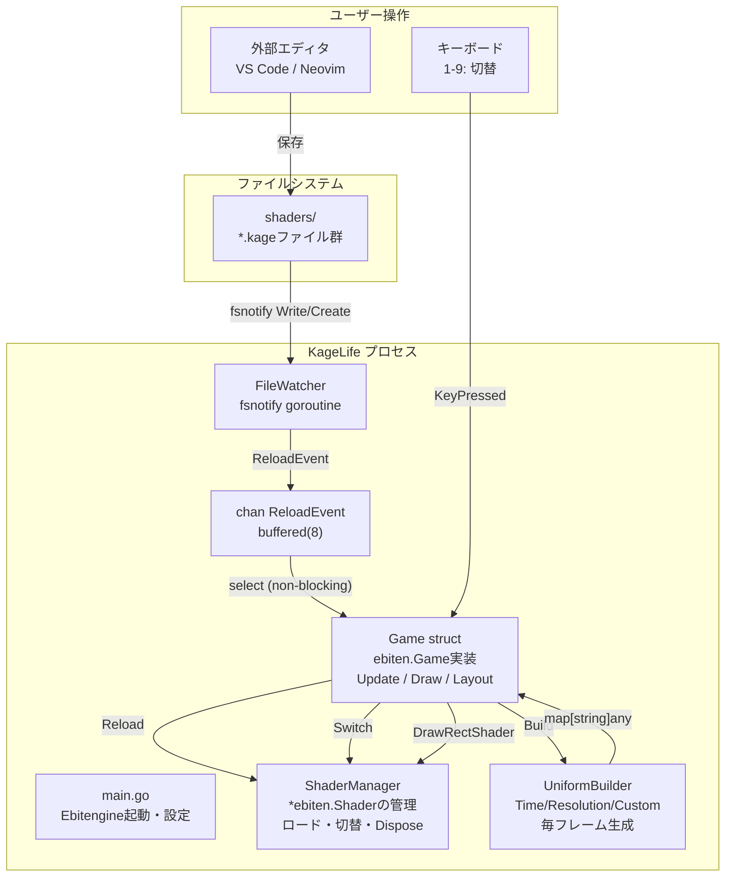
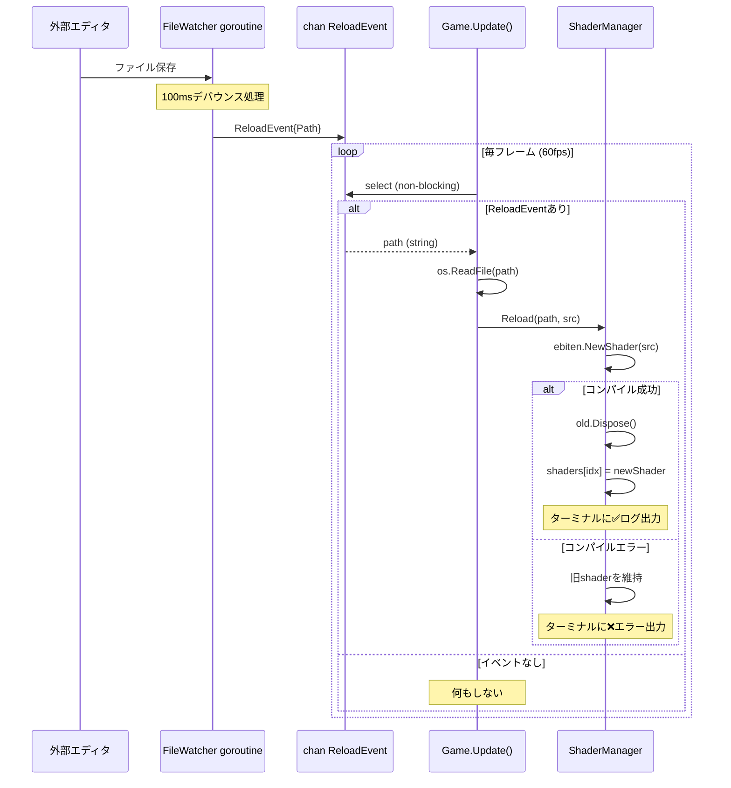
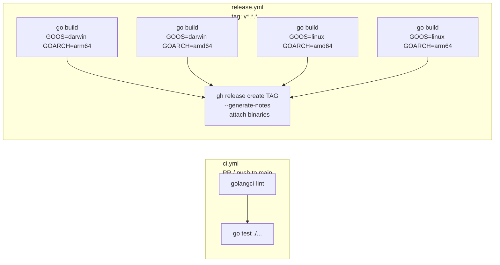
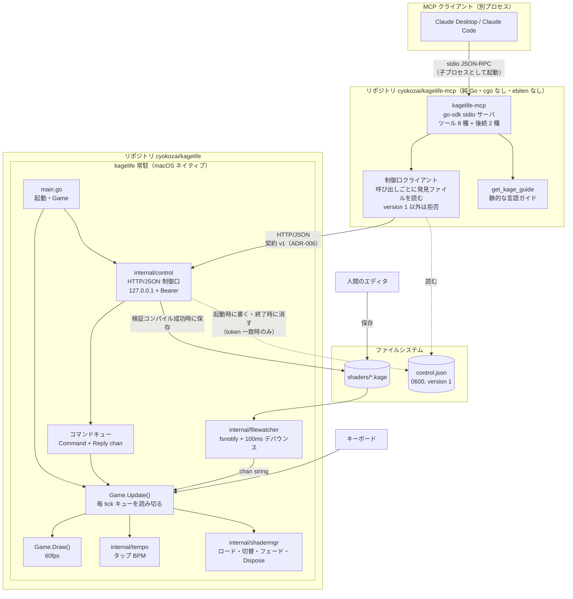

# アーキテクチャ設計書: KageLife

**作成日**: 2026-04-18
**更新日**: 2026-09-30（MCP 連携の節を追加）

---

## システム全体構成図



---

## ホットリロード シーケンス



---

## パッケージ構成

```
kagelife/
├── main.go                        # エントリーポイント・Game struct (Update/Draw/Layout)
├── internal/
│   ├── shadermgr/
│   │   ├── manager.go             # Manager: ロード・切替・Dispose（ebiten非依存）
│   │   └── manager_test.go
│   └── filewatcher/
│       ├── watcher.go             # Watcher: fsnotify goroutine + デバウンス
│       └── watcher_test.go
├── shaders/                       # ユーザーが編集する .kage ファイル置き場
│   └── example.kage
├── docs/
│   ├── prd.md
│   ├── architecture-decisions.md
│   ├── adr/
│   └── discovery/
└── .github/
    ├── release.yml       # リリースノートのラベル分類設定
    └── workflows/
        ├── ci.yml        # lint + test
        └── release.yml   # クロスコンパイル + GitHub Release
```

---

## 主要な型設計

```go
// ReloadEvent: FileWatcher → Game への通知
type ReloadEvent struct {
    Path string
}

// ShaderManager: シェーダーの一元管理
type ShaderManager struct {
    shaders []*ebiten.Shader  // ロード済みシェーダースライス
    names   []string          // ファイル名（表示用）
    active  int               // 現在アクティブなインデックス
}

// Game: ebiten.Game インターフェース実装
type Game struct {
    sm      *ShaderManager
    watcher *FileWatcher
    events  chan ReloadEvent   // buffered(8)
    startAt time.Time         // Time Uniform用
}
```

---

## CI/CD パイプライン



### リリースノートの自動生成

`.github/release.yml` でPRラベルをセクション分類:

```yaml
changelog:
  categories:
    - title: "✨ New Features"
      labels: ["enhancement"]
    - title: "🐛 Bug Fixes"
      labels: ["bug"]
    - title: "🔧 Maintenance"
      labels: ["chore", "dependencies"]
```

---

## MCP 連携（2026-09-30 追加）

LLM（Claude Desktop / Claude Code）を VJ の共演者にするための構成。
決定の経緯は ADR-005（プロセス構成）、ADR-006（制御口 v1）、ADR-007（SDK と依存方針）、前提は assumptions-20260930。

MCP サーバは別リポジトリ `cyokozai/kagelife-mcp`（public、main ← dev ← feat）の別バイナリ `kagelife-mcp` とする。
本リポジトリ（kagelife）が持つのは、常駐 GUI 側の制御口（`internal/control`）と、その契約（ADR-006）である。

上の節（2026-04-18）は初期設計のまま残す。現行の実装（dev）では、watcher から Game への通知は `chan string`（容量 8）で、
`internal/tempo`（タップテンポ）が加わっている。本節の図はこの現行実装を土台に描く。

### システム全体構成図（MCP 追加後）



2 つのリポジトリの結び目は、制御口の契約 v1（ADR-006）と発見ファイルだけである。kagelife-mcp は kagelife のパッケージを import しない。

### データフロー

| 経路 | 起点 → 終点 | 運ぶもの | 同期の方法 |
|------|-----------|---------|-----------|
| ツール呼び出し | MCP クライアント → `kagelife-mcp` | JSON-RPC（stdio） | go-sdk（kagelife-mcp 側） |
| 中継 | `kagelife-mcp` → 制御口 | HTTP/JSON + Bearer トークン | 呼び出しごとに発見ファイルを読む。`version` が 1 以外なら接続しない |
| コマンド | 制御口 HTTP goroutine → `Game.Update()` | Command と返信チャネル | channel（ADR-002 の延長）。2 秒で `loop_timeout` |
| 検証コンパイル | 制御口 HTTP goroutine 内 | Kage ソース → `*ebiten.Shader` / diagnostics | `NewShader` は別 goroutine でも安全 |
| 作品の保存 | 制御口 → `shaders/<名前>.kage` | 成功したソース | 一時ファイル＋rename |
| ホットリロード | `shaders/` → filewatcher → `Game.Update()` | ファイルパス | `chan string`（容量 8） |
| 画面取得（段階 2） | `Draw` / `Update` → 制御口 | 縮小したピクセル | ReadPixels はループ内、符号化はループ外 |

原則:
- `Image` の描画操作・`ReadPixels`・Manager の状態変更は `Update` / `Draw` の中に閉じ込める
- ゲームループの外から状態を変える経路は、ファイル経路と制御口のコマンドキューの 2 本だけ。どちらも channel で受ける（mutex を使わない）

### パッケージ構成（MCP 追加後）

kagelife（本リポジトリ）:

```
kagelife/
├── main.go                        # 起動時に制御口を開き、Game.Update で制御口のキューを毎 tick 読み切る
│                                  # mcp サブコマンドは持たない
├── internal/
│   ├── shadermgr/                 # 既存: ロード・切替・フェード・Dispose（ebiten 非依存）
│   ├── filewatcher/               # 既存: fsnotify + デバウンス
│   ├── tempo/                     # 既存: タップテンポ
│   └── control/                   # 新規（feat/mcp-control-api）: ebiten 非依存
│       ├── server.go              #   HTTP ルーティング・Bearer 認証・エラー共通形
│       ├── discovery.go           #   発見ファイルの書き込み（0600）・token 一致時のみ削除
│       ├── command.go             #   Command / Reply の型とキュー
│       ├── diagnostics.go         #   コンパイルエラー → diagnostics（範囲内・最大 10 件）
│       └── *_test.go              #   httptest + モックのコンパイラ
└── shaders/
```

kagelife-mcp（別リポジトリ。構成は同リポジトリで決める。以下は目安）:

```
kagelife-mcp/
├── main.go                        # stdio の MCP サーバを起動
└── internal/
    ├── mcpserver/                 # go-sdk のツール定義（8 種 + 後続 2 種）
    ├── controlclient/             # 制御口クライアント（発見ファイルを呼び出しごとに読む・version 検査）
    └── guide/                     # get_kage_guide の本文
```

- `internal/control` はコンパイラを関数として受け取る（`shadermgr` と同じ注入の形）。ebiten を import しないので CGO 無しでテストできる
- go-sdk を import するのは kagelife-mcp だけ（ADR-007）。kagelife 本体の依存は変わらない
- ファイル名は目安。実装 PR で変えてよい

### 主要な型（目安、kagelife 側）

```go
// 制御口 → Game.Update への要求
type Command struct {
    Kind  CommandKind  // State / Replace / Switch / Crossfade / SetBPM ...
    Name  string       // シェーダ名（拡張子なし）
    // 種類ごとの引数
    Reply chan Reply   // 容量 1。Update が必ず 1 回だけ送る
}

type Reply struct {
    Body any    // 成功時のレスポンス
    Err  *APIError
}

// エラー共通形（ADR-006）
type APIError struct {
    Status      int          `json:"-"`
    Code        string       `json:"error"`
    Message     string       `json:"message"`
    Diagnostics []Diagnostic `json:"diagnostics,omitempty"`
}

type Diagnostic struct {
    Line    int    `json:"line"`
    Col     int    `json:"col"`
    Message string `json:"message"`
}
```

### テストの置き場所

| 対象 | リポジトリ | テスト | CI |
|------|-----------|-------|----|
| `internal/control` | kagelife | 認証・名前検査・本文とソースの上限・`unit_pixels_required`・diagnostics 整形・`loop_timeout`・ADR-006 補足 1〜15（httptest、モックのコンパイラ、偽の Update） | 入れる |
| diagnostics の実データ | kagelife | `ebiten.NewShader` の実エラーからの整形 | NewShader はウィンドウ無しで動くので入れられる |
| MCP サーバ | kagelife-mcp | ツールのスキーマ・中継・`isError` の形・`version` 検査・stdin EOF 終了（偽の制御口） | 入れる（`-race`、純 Go） |
| GUI とキューの結合 | kagelife | 往復時間・差し替え | 入れない（ウィンドウが要る。Alpine で SIGSEGV）。macOS 実機で手動 |
| 両者を結合した E2E | 両方にまたがる | 実 GUI ＋ 実 `kagelife-mcp` | 入れない。macOS 実機で手動 |
