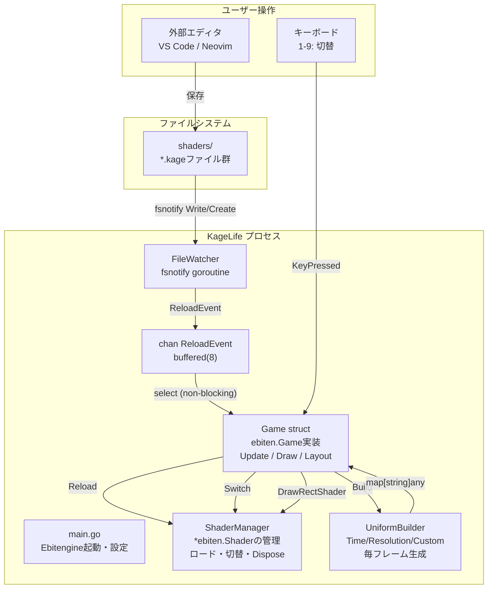
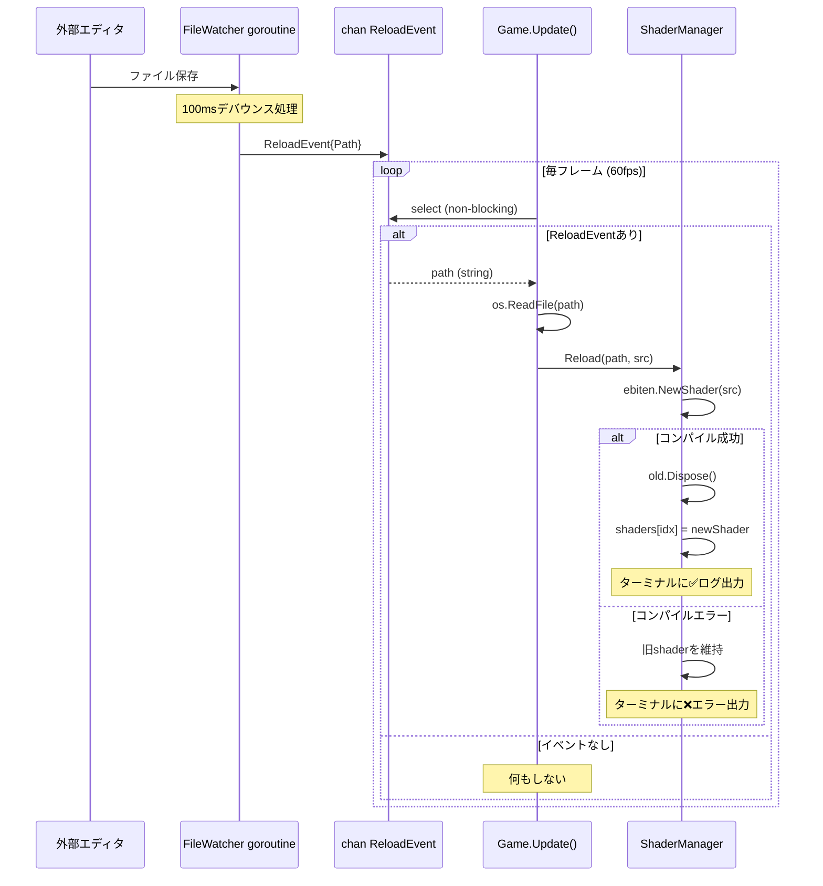
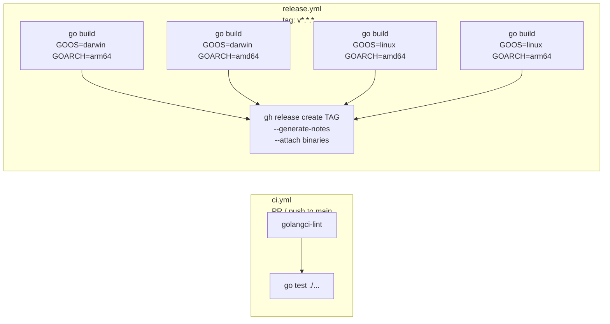

# アーキテクチャ設計書: KageLife

**作成日**: 2026-04-18

---

## システム全体構成図



---

## ホットリロード シーケンス



---

## パッケージ構成

```
kagelife/
├── main.go                        # エントリーポイント・Game struct (Update/Draw/Layout)
├── internal/
│   ├── shadermgr/
│   │   ├── manager.go             # Manager: ロード・切替・Dispose（ebiten非依存）
│   │   └── manager_test.go
│   └── filewatcher/
│       ├── watcher.go             # Watcher: fsnotify goroutine + デバウンス
│       └── watcher_test.go
├── shaders/                       # ユーザーが編集する .kage ファイル置き場
│   └── example.kage
├── docs/
│   ├── prd.md
│   ├── architecture-decisions.md
│   ├── adr/
│   └── discovery/
└── .github/
    ├── release.yml       # リリースノートのラベル分類設定
    └── workflows/
        ├── ci.yml        # lint + test
        └── release.yml   # クロスコンパイル + GitHub Release
```

---

## 主要な型設計

```go
// ReloadEvent: FileWatcher → Game への通知
type ReloadEvent struct {
    Path string
}

// ShaderManager: シェーダーの一元管理
type ShaderManager struct {
    shaders []*ebiten.Shader  // ロード済みシェーダースライス
    names   []string          // ファイル名（表示用）
    active  int               // 現在アクティブなインデックス
}

// Game: ebiten.Game インターフェース実装
type Game struct {
    sm      *ShaderManager
    watcher *FileWatcher
    events  chan ReloadEvent   // buffered(8)
    startAt time.Time         // Time Uniform用
}
```

---

## CI/CD パイプライン



### リリースノートの自動生成

`.github/release.yml` でPRラベルをセクション分類:

```yaml
changelog:
  categories:
    - title: "✨ New Features"
      labels: ["enhancement"]
    - title: "🐛 Bug Fixes"
      labels: ["bug"]
    - title: "🔧 Maintenance"
      labels: ["chore", "dependencies"]
```
