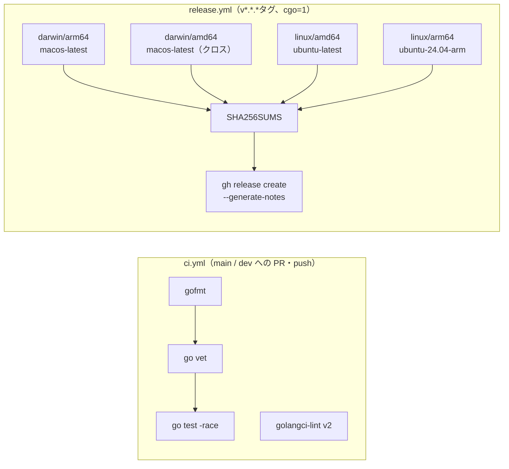

# 開発プロセス設計書: KageLife

**作成日**: 2026-04-18
**更新日**: 2026-10-02（W2-1 の `internal/uniform`・`-version`・ウィンドウタイトル・HUD の `(default)`・削除の配線、#24 の `internal/control` を反映）

---

## 開発スタイル

1人・1週間の個人開発。スクラム/カンバンは採用しない。
**タスクリスト + 日次TDDサイクル**で進める。

---

## TDD サイクル（t_wada流）

```
Red   → 失敗するテストを書く
Green → テストが通る最小限のコードを書く
Refactor → コードをきれいにする（テストは常にグリーン）
```

### テスト対象

| コンポーネント | テスト種別 | 観点 |
|-------------|---------|------|
| `ShaderManager`（`internal/shadermgr`） | ユニット | Dispose呼び出し、エラー時フォールバック、インデックス境界（コンパイル関数をモックに差し替える） |
| `FileWatcher`（`internal/filewatcher`） | ユニット | デバウンス処理（短いデバウンス間隔でテスト用に生成）、`Close()` の冪等性 |
| `Tapper`（`internal/tempo`） | ユニット | BPM の算出、スライド窓、タイムアウト、拍の位相 |
| `UniformBuilder`（`internal/uniform`） | ユニット | 予約 Uniform（Time・Resolution・Beat・Cursor・Frame・Random）の値の正確性、map とスライスの使い回し（`internal/uniform` のテスト。W2-1 で追加） |
| 制御口（`internal/control`） | ユニット | 認証・名前検査・上限・diagnostics 整形・`loop_timeout`・[ADR-006](adr/ADR-006-control-api.md) の補足 1〜18（httptest、モックのコンパイラ。#24 で追加） |
| クロスフェード（`internal/shadermgr`） | ユニット | フェード中の再指示、積算による進行（`TickAt`）、スロットのファイル名順固定と `Remove`（[ADR-008](adr/ADR-008-crossfade-compositing.md)） |
| ホットリロード全体 | 統合 | ファイル書き換え → Reload呼び出しの連鎖、保存〜反映の時間（W1-2 で追加、最悪 103.1 ms（Linux）） |

### テスト対象外（目視確認）

- 実際のシェーダー描画結果（VJ演出は目視でOK）
- Ebitengineの描画API自体

---

## 1週間タスクリスト

### Day 1 — PoC（技術リスクの排除）
- [x] `ebiten.NewShader()`を同一プロセスで複数回呼び出せることを確認（再ロードのたびに呼ぶ形で実装）
- [x] `(*ebiten.Shader).Dispose()`の動作を確認（再ロード時に旧シェーダーを解放）
- [x] コンパイルエラーを`error`として受け取れることを確認
- [x] `Time`/`Resolution`をUniformとして渡す最小実装

### Day 2-3 — Core実装
- [x] `FileWatcher`: fsnotify + デバウンス(100ms) + channel（`internal/filewatcher`。channel は `chan string`、[ADR-002](adr/ADR-002-hotreload-mechanism.md) の注記を参照）
- [x] `ShaderManager`: ロード・切替・Dispose（`internal/shadermgr`）
- [x] `UniformBuilder`: Time/Resolution自動注入（当初は `Game.Draw()` で組み立て、W2-1 で `internal/uniform` の `Builder` に分けた）
- [x] `Game.Update()`: channel受信 + Reload呼び出し
- [x] `Game.Draw()`: DrawRectShader呼び出し

### Day 4 — 品質・UX
- [x] エラーログのフォーマット整備（ファイル名・行番号付き）（`path:行:列: msg` の形式。エラーはファイルごとに保持）
- [x] 起動時シェーダー一覧のターミナル表示（1 始まりの番号。シェーダー追加時にも一覧を出力）
- [x] ウィンドウタイトルに現在シェーダー名を表示（W2-1）
- [x] ユニットテストを揃える（`internal/` の各パッケージ。`main.go` は対象外）
- [x] `-version` フラグ（`kagelife <version>` を出して終了。Makefile の `-X main.version` で埋め込む。W2-1）

### Day 5 — Could（時間があれば）
- [x] タップBPM（スペースキー → Uniformに流す）（`internal/tempo`、`Beat` Uniform。[ADR-008](adr/ADR-008-crossfade-compositing.md) の D3 を含む）
- [x] Q-001の決定: カスタムUniform定義方式（v1.0 では扱わない。MCP 段階 2 の set_uniform（PRD FR-130、feat/mcp-uniform-params）で確定する）

### v1.0 に前倒しした機能
- [x] クロスフェード（Shift+数字、`[` `]` で拍数）（合成・再指示・進み具合は [ADR-008](adr/ADR-008-crossfade-compositing.md) に従う）
- [x] `Cursor` / `Frame` / `Random` Uniform
- [x] HUD（H）・フルスクリーン（F）・リサイズと DPI 対応（`LayoutF`）
- [x] [ADR-008](adr/ADR-008-crossfade-compositing.md) の D1〜D3 と積算による進み具合
- [x] `Remove`（ファイル削除時のスロット除去）の `main.go` への配線（filewatcher の `Removed` → `Engine.RemoveFile`。W2-1）
- [x] `Measured()` の HUD 表示（既定値の BPM に `(default)` を付ける。W2-1）

### Day 6 — テスト・リファクタリング
- [x] `go test ./...`がグリーンになること
- [x] `golangci-lint`がパスすること
- [x] README.md の初稿
- [x] ホットリロードの統合テスト（保存〜反映の時間を含む。W1-2 で追加、最悪 103.1 ms（Linux）。macOS は未確認）

### Day 7 — リリース
- [x] `.github/workflows/ci.yml`
- [x] `.github/workflows/release.yml`（実際の Actions では未実行。cgo=1 のネイティブビルド、[ADR-003](adr/ADR-003-cross-platform.md) / [ADR-004](adr/ADR-004-cicd-release.md)）
- [x] `.github/release.yml`（リリースノート分類）
- [x] Makefile の package / checksum、Ebitengine のビルド依存をまとめた composite action（setup-ebiten）
- [ ] LICENSE ファイルの追加（配布物に同梱する）
- [ ] 性能の実測（起動〜最初の描画 < 2秒、長時間実行でのメモリ）
- [ ] `v1.0.0`タグを打ってGitHub Releaseを確認

---

## ブランチ戦略

個人開発なので GitHub Flow（シンプル版）に統合ブランチ `dev` を加えた形を採用:

```
main ← 常に動く状態を保つ
dev ← 統合ブランチ。作業ブランチの PR はここへマージする
feat/xxx, fix/xxx, docs/xxx ← 作業単位で作成、小さいPRでマージ
```

CI（`ci.yml`）は `main` と `dev` の両方への push / PR で動く。

**コミットメッセージ規約** (Conventional Commits):
```
feat: ホットリロード機能を追加
fix: fsnotifyの重複イベントを修正
chore: go.modを更新
```
→ リリースノートの自動生成に使われるため規約を守る

---

## CI/CD パイプライン



- 各ビルドは tar.gz（バイナリ・`shaders/`・README・LICENSE）を作る
- `release.yml` は実際の Actions ではまだ実行しておらず、ランナーの提供状況も未確認
