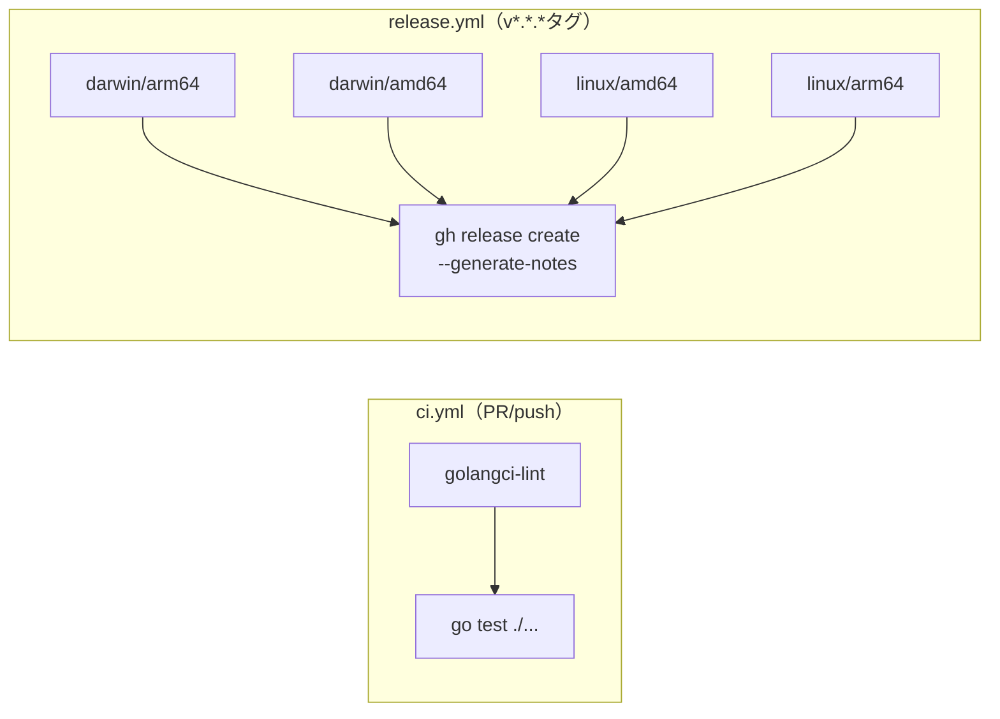

# 開発プロセス設計書: KageLife

**作成日**: 2026-04-18

---

## 開発スタイル

1人・1週間の個人開発。スクラム/カンバンは採用しない。
**タスクリスト + 日次TDDサイクル**で進める。

---

## TDD サイクル（t_wada流）

```
Red   → 失敗するテストを書く
Green → テストが通る最小限のコードを書く
Refactor → コードをきれいにする（テストは常にグリーン）
```

### テスト対象

| コンポーネント | テスト種別 | 観点 |
|-------------|---------|------|
| `ShaderManager` | ユニット | Dispose呼び出し、エラー時フォールバック、インデックス境界 |
| `FileWatcher` | ユニット | デバウンス処理（タイマーモック） |
| `UniformBuilder` | ユニット | Time/Resolution値の正確性 |
| ホットリロード全体 | 統合 | ファイル書き換え → Reload呼び出しの連鎖 |

### テスト対象外（目視確認）

- 実際のシェーダー描画結果（VJ演出は目視でOK）
- Ebitengineの描画API自体

---

## 1週間タスクリスト

### Day 1 — PoC（技術リスクの排除）
- [ ] `ebiten.NewShader()`を同一プロセスで複数回呼び出せることを確認
- [ ] `(*ebiten.Shader).Dispose()`の動作を確認
- [ ] コンパイルエラーを`error`として受け取れることを確認
- [ ] `Time`/`Resolution`をUniformとして渡す最小実装

### Day 2-3 — Core実装
- [ ] `FileWatcher`: fsnotify + デバウンス(100ms) + channel
- [ ] `ShaderManager`: ロード・切替・Dispose
- [ ] `UniformBuilder`: Time/Resolution自動注入
- [ ] `Game.Update()`: channel受信 + Reload呼び出し
- [ ] `Game.Draw()`: DrawRectShader呼び出し

### Day 4 — 品質・UX
- [ ] エラーログのフォーマット整備（ファイル名・行番号付き）
- [ ] 起動時シェーダー一覧のターミナル表示
- [ ] ウィンドウタイトルに現在シェーダー名を表示
- [ ] ユニットテストを揃える

### Day 5 — Could（時間があれば）
- [ ] タップBPM（スペースキー → Uniformに流す）
- [ ] Q-001の決定: カスタムUniform定義方式

### Day 6 — テスト・リファクタリング
- [ ] `go test ./...`がグリーンになること
- [ ] `golangci-lint`がパスすること
- [ ] README.md の初稿

### Day 7 — リリース
- [ ] `.github/workflows/ci.yml`
- [ ] `.github/workflows/release.yml`
- [ ] `.github/release.yml`（リリースノート分類）
- [ ] `v1.0.0`タグを打ってGitHub Releaseを確認

---

## ブランチ戦略

個人開発なので GitHub Flow（シンプル版）を採用:

```
main ← 常に動く状態を保つ
feature/xxx ← 機能単位で作成、小さいPRでマージ
```

**コミットメッセージ規約** (Conventional Commits):
```
feat: ホットリロード機能を追加
fix: fsnotifyの重複イベントを修正
chore: go.modを更新
```
→ リリースノートの自動生成に使われるため規約を守る

---

## CI/CD パイプライン


