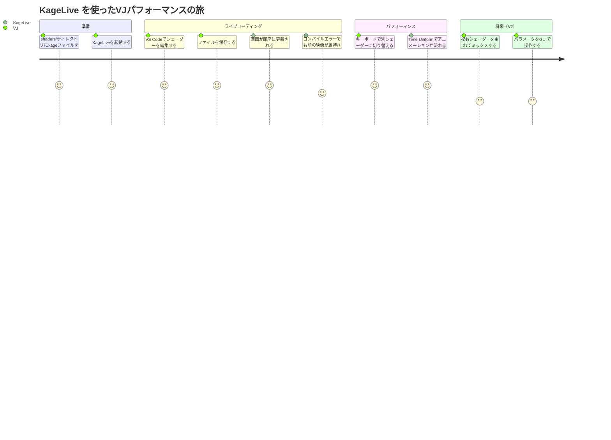

# Phase 1: Problem Space — KageLive

## JTBD（Jobs To Be Done）

> **ジョブ（Core Job）**
> VJパフォーマンス中に、Kageシェーダーをリアルタイムに切り替え・プレビューしたい。
> ファイルを保存したら即座に反映され、時間ベースのUniformが自動で流れることで、
> コードを書きながら視覚的なフィードバックを得たい。

### ジョブの分解

| ジョブタイプ | 内容 |
|------------|------|
| **Functional Job** | シェーダーを保存 → 即画面に反映させる |
| **Functional Job** | 複数シェーダーをキーボードで瞬時に切り替える |
| **Emotional Job** | 「コードを書いている感覚」のまま映像演出できる |
| **Social Job** | Go/Ebitengineエコシステム内でVJを完結させる |

### ペインポイント

| ペイン | 既存解決策の限界 |
|--------|--------------|
| GLSLは書けるがKageで同様のツールがない | KodeLifeはGLSL専用 |
| 別言語のランタイムを入れたくない | Hydra/TidalCyclesはNode.js/Haskell依存 |
| 重いツールを起動したくない | TouchDesignerは大規模すぎる |
| BPM同期はV2でいい | 今は時間ベースで十分 |

## カスタマージャーニーマップ

