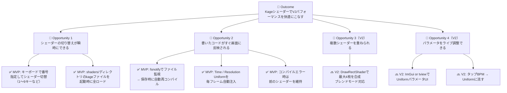

# Phase 2: Solution Space — KageLive

## 価値提案

> **KageLiveは、Ebitengine/Kageシェーダーをファイル保存だけでリアルタイム反映し、
> キーボードで瞬時に切り替えられる、Go開発者のためのVJライブコーディングツールです。**

## North Star Metric

> **「ファイル保存からシェーダー反映までのレイテンシが体感ゼロ（< 200ms）」**

## Opportunity Solution Tree



## User Story Map

```
┌─────────────────────────────────────────────────────────────────┐
│  Backbone（ユーザー活動）                                          │
├──────────────┬──────────────┬──────────────┬────────────────────┤
│  起動         │  ライブコーディング│  切り替え      │  パフォーマンス      │
├──────────────┼──────────────┼──────────────┼────────────────────┤
│ [MVP]        │ [MVP]        │ [MVP]        │ [MVP]              │
│ shaders/を   │ .kageファイルを│ 1〜9キーで   │ Timeが自動で流れ    │
│ スキャン      │ 外部エディタで │ シェーダー切替│ アニメーション       │
│ 全シェーダー  │ 編集・保存    │              │                    │
│ をロード      │              │              │                    │
├──────────────┼──────────────┼──────────────┼────────────────────┤
│ [MVP]        │ [MVP]        │ [Should]     │ [Could]            │
│ 起動時に     │ 保存検知→    │ ターミナルに │ スペースでタップBPM │
│ シェーダー   │ 自動再コンパイル│ シェーダー  │ → Uniformに渡す    │
│ 一覧を表示   │ → 即時反映   │ 一覧を表示   │                    │
├──────────────┼──────────────┼──────────────┼────────────────────┤
│              │ [Should]     │              │                    │
│              │ エラー時は   │              │                    │
│              │ 前のシェーダー│              │                    │
│              │ を維持       │              │                    │
└──────────────┴──────────────┴──────────────┴────────────────────┘
```
