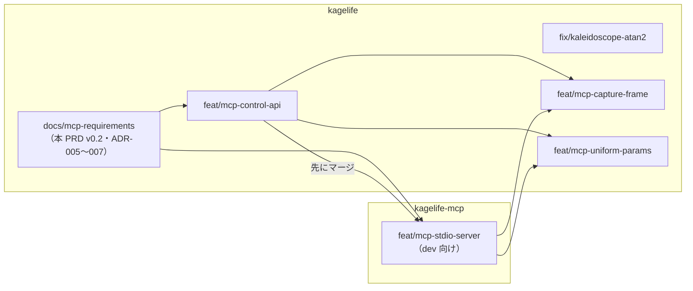

# PRD: KageLife

**バージョン**: 0.3
**作成日**: 2026-04-18
**更新日**: 2026-10-01
**ステータス**: v0.1 部分と v1.0 へ前倒しした機能（v0.3）は Approved / v0.2 追加分（MCP）は Draft
**オーナー**: cyokozai

### 変更履歴

| 版 | 日付 | 内容 |
|----|------|------|
| 0.1 | 2026-04-18 | 初版 |
| 0.2 | 2026-09-30 | MCP 連携（LLM 共演 VJ）の章を追加。依存表・スコープ・未解決事項を更新。本番 VJ 中の障害対応を付録に追加。前提は [assumptions-20260930.md](assumptions-20260930.md)。MCP サーバは別リポジトリ `cyokozai/kagelife-mcp` に置く（同日決定） |
| 0.3 | 2026-10-01 | 実装との整合。v1.0 へ前倒しした機能（タップBPM・クロスフェード・`Cursor` / `Frame` / `Random`・HUD・フルスクリーン・DPI 対応）の FR（FR-006・FR-007・FR-013〜FR-016・FR-023〜FR-025・FR-030〜FR-033・FR-040〜FR-042）を追加。In Scope のチェック、§7 の依存、NFR の実測値、Q-002 の補足を更新。クロスフェードの決定は [ADR-008](adr/ADR-008-crossfade-compositing.md)。制御口の BPM の扱いを D3 に合わせた（Q-008 をクローズ、FR-114・FR-115 と ADR-006 を改訂） |

---

## 1. エグゼクティブサマリー

KageLifeは、Ebitengine/Kageシェーダーをファイル保存だけでリアルタイム反映し、
キーボードで瞬時に切り替えられる、Go開発者のためのVJライブコーディングツール。

外部エディタ（VS Code / Neovim等）でKageシェーダーを編集・保存すると、
即座に画面に反映される。`Time`・`Resolution`などのUniformは自動で注入され、
キーボード（1〜9）で複数シェーダーを切り替えてVJパフォーマンスを行える。

**なぜ今やるか:**
Go/Ebitengineエコシステム内で完結するVJライブコーディングツールが存在しない。
KodeLife（GLSL専用）やHydra（Node.js依存）の代替として、
Goネイティブで動作する軽量ツールの需要がある。

**v0.2 の追加:**
LLM（Claude Desktop / Claude Code）を VJ の共演者にする MCP サーバを足す。
LLM はシェーダを書き換え、コンパイルエラーの行と列を読んで直し、BPM とクロスフェードを操作し、
画面を見て次の手を決める。GUI は常駐させ、別リポジトリ `cyokozai/kagelife-mcp` の別バイナリ `kagelife-mcp` が stdio を受けて
localhost の制御口へ中継するので、MCP クライアントが落ちても映像は止まらない（§11）。

---

## 2. 目標と成功指標

### 技術目標

| 目標 | 指標 | 目標値 |
|------|------|--------|
| ホットリロード応答性 | 保存〜画面反映レイテンシ | < 200ms |
| 安定性 | コンパイルエラーでもクラッシュしない | エラー時に前のシェーダーを維持 |
| 起動速度 | 起動〜最初の描画 | < 2秒 |
| クロスプラットフォーム | 対応OS | macOS (arm64/amd64) + Linux (amd64/arm64) |
| MCP 応答性（v0.2） | ツール呼び出し〜画面反映（LLM の生成時間を除く） | < 200ms |
| MCP 分離（v0.2） | MCP 側の障害で描画が止まらない | MCP クライアント終了・中継の異常時も 60fps を維持 |

---

## 3. スコープ

### In Scope（MVP v1.0）

- [x] `.kage`ファイルのホットリロード（fsnotify + 自動再コンパイル）
- [x] `Time` / `Resolution` Uniformの毎フレーム自動注入
- [x] 複数シェーダーをキー（1〜9）で切り替え
- [x] コンパイルエラー時に前のシェーダーを維持（クラッシュしない）
- [x] 起動時にシェーダー一覧をターミナル表示
- [x] `*ebiten.Shader`の明示的`Dispose()`によるメモリ管理

### In Scope（v1.0 へ前倒しした機能）

当初は V2+ または Could としていたが、実装が先行したため v1.0 に含める。要件は §5 の FR-013 以降・FR-023 以降・FR-030 以降・FR-040 以降に記す。

- [x] タップBPMと`Beat` Uniform（スペースキー）
- [x] クロスフェード（Shift+数字キー、`[` `]`で拍数を変更）。合成方式などの決定は [ADR-008](adr/ADR-008-crossfade-compositing.md)
- [x] `Cursor` / `Frame` / `Random` Uniformの毎フレーム自動注入
- [x] HUD 表示（Hキーで切り替え）
- [x] フルスクリーン切り替え（Fキー）
- [x] ウィンドウのリサイズとDPI対応（`LayoutF`）

### In Scope（MCP MVP、v0.2 追加）

| 項目 | 内容 | リポジトリ: ブランチ | 段階 |
|------|------|---------|------|
| 制御口 v1 | 127.0.0.1 限定 HTTP/JSON、トークン認証、発見ファイル、Update キュー（ADR-006） | kagelife: feat/mcp-control-api | 1 |
| MCP 中継 | 別バイナリ `kagelife-mcp`（stdio、純 Go）と 8 ツール（FR-110〜FR-117） | kagelife-mcp: feat/mcp-stdio-server | 1 |
| 画面の確認 | capture_frame（FR-120） | kagelife: feat/mcp-capture-frame ＋ kagelife-mcp 側のツール追加 | 2 |
| ユーザー定義 uniform | set_uniform（FR-130、Q-001 の決着） | kagelife: feat/mcp-uniform-params ＋ kagelife-mcp 側のツール追加 | 2 |

段階 1 の 2 本（別リポジトリ）は並行して作り、control-api を先にマージする。段階 2 は段階 1 のマージ後に作る。

### Out of Scope（明示的に除外）

- シェーダー重ね合わせ（V2: DrawRectShader複数パス設計が必要。v1.0 のクロスフェードは 2 枚の遷移に限る）
- GUIパラメータUI（V2: ImGui/tview統合コスト高）
- Ableton Link / MIDI連携（V2: Go実装が少ない）
- WASM対応（V2: ホットリロードと根本的に相性が悪い）
- 頂点シェーダー（Kageの仕様上フラグメントシェーダのみ）
- （v1.0）カスタムUniform。定義方式は Q-001 のとおり MCP 段階 2 の set_uniform（FR-130）で決める
- （v0.2）差分でのシェーダ編集。write_shader は丸ごと置き換え
- （v0.2）重いシェーダの自動ロールバック。MVP は get_state の fps で知らせるだけ
- （v0.2）シェーダの削除・リネーム
- （v0.2）ループバック以外からの制御、MCP の Streamable HTTP トランスポート
- （v0.2）LLM 利用料の扱い（利用者の Claude 契約で賄う）

### 将来フェーズ（V2+）

- シェーダーレイヤー合成（最大9枚、加算合成 + アルファブレンド。[discovery-interview-v2.md](discovery-interview-v2.md) を参照）
- GUI（TUI）によるカスタムUniformパラメータのリアルタイム調整（パラメータ層は set_uniform と共有する。FR-131）
- WASMビルド（ファイルアップロード型プレビューア）
- Ableton Link / MIDI Clock受信

※ タップBPMは当初 V2+ としていたが（Day 5 の Could とも記載が食い違っていた）、v1.0 に前倒しした。

---

## 4. ユーザーストーリー

### ペルソナ

**VJ兼Goエンジニア（作者自身）**: Goを書けるVJアーティスト。
KageシェーダーをライブコーディングしながらVJパフォーマンスをしたい。

**LLM を共演者とする演者（v0.2 追加）**: 作者本人が、Claude Desktop または Claude Code に指示を出しながら演じる。
LLM はシェーダを書き、エラーを読んで直し、BPM とフェードを操作する。演者は必要ならキーボードで割り込む。
LLM は利用者ではなく、MCP のツールを呼ぶ共演者として扱う。観客は画面を見るだけ。

### ストーリーマップ

| Epic | ユーザーストーリー | 受け入れ条件 | 優先度 |
|------|-----------------|------------|--------|
| ホットリロード | シェーダーファイルを保存したら、200ms以内に画面に反映されてほしい | fsnotify検知 → 再コンパイル → 描画更新が200ms以内 | Must |
| エラー耐性 | コンパイルエラーが出ても画面が止まらないでほしい | エラー時に前のシェーダーを維持。エラー内容はターミナルに出力 | Must |
| Uniform自動注入 | Timeを書くだけでアニメーションしてほしい | `Time`・`Resolution`が毎フレーム自動で注入される | Must |
| シェーダー切り替え | キーボードでシェーダーをすぐ切り替えたい | 1〜9キーで対応するシェーダーに即時切り替え | Must |
| メモリ管理 | 長時間使ってもメモリが増え続けないでほしい | 再ロード時に旧Shaderをきっちり Dispose() する | Should |
| クロスフェード | 曲の拍に合わせてシェーダーを滑らかに移り変わらせたい | Shift+数字で、指定した拍数をかけて次のシェーダーへ遷移する | Should（v1.0 前倒し） |
| タップBPM | 曲のテンポをシェーダーに伝えたい | スペースキーのタップ間隔からBPMを求め、`Beat`に拍内の位相が入る | Should（v1.0 前倒し） |
| LLM 共演（v0.2） | LLM に頼んだシェーダがすぐ画面に出てほしい | write_shader → 反映 200ms 未満（生成時間を除く）。成功分は `shaders/` に残る | Must |
| LLM 共演（v0.2） | LLM がエラーを出しても映像が止まらず、LLM が自分で直してほしい | 前のシェーダを維持。行・列付きの diagnostics（範囲内・最大 10 件）が LLM に返る | Must |
| LLM 共演（v0.2） | LLM に状態を読ませ、拍に合わせてフェードさせたい | get_state / set_bpm / crossfade が使える | Must |
| LLM 共演（v0.2） | クライアントが落ちても映像は流れ続けてほしい | GUI は別プロセスで常駐。中継の失敗は isError で返り描画に影響しない | Must |
| LLM 共演（v0.2） | LLM に画面を見せて次の手を考えさせたい | capture_frame が縮小画像を返す | Must（段階 2） |

詳細は [discovery-interview-mcp.md](discovery-interview-mcp.md)。

---

## 5. 機能要件

### ホットリロード

**概要**: `shaders/`ディレクトリの`.kage`ファイルを監視し、変更時に自動再コンパイルする。

**詳細要件**:
- FR-001: 起動時に`shaders/`ディレクトリをスキャンし、全`.kage`ファイルをコンパイル・ロード
- FR-002: `fsnotify`で`shaders/`ディレクトリを監視し、Write/Createイベントを検知
- FR-003: イベント検知後、対象ファイルを再コンパイルし、成功時に`*ebiten.Shader`を差し替え
- FR-004: 再コンパイル時に旧`*ebiten.Shader`を`.Dispose()`で解放
- FR-005: コンパイルエラー時は旧`*ebiten.Shader`を維持し、エラーを`path:行:列: msg`の形式でstderrに出力。エラーはファイルごとに保持する
- FR-006: 同一ファイルへのイベントは 100ms のデバウンスでまとめる（Q-002 で確定）
- FR-007: シェーダーのスロット（キー`1`〜`9`との対応）はファイル名順に固定する。起動時の一覧は 1 始まりの番号で出力し、キーの番号と揃える

### Uniform自動注入

**概要**: 毎フレーム、標準Uniformを自動で`DrawRectShaderOptions.Uniforms`に注入する。

**詳細要件**:
- FR-010: `Time float32` — 起動からの経過時間（秒）を毎フレーム注入
- FR-011: `Resolution [2]float32` — 描画先の`{width, height}`を毎フレーム注入
- FR-012: Kageシェーダー側でこれらを宣言しなかった場合もエラーにしない（Kageの仕様上、未使用Uniformは無視される）
- FR-013: `Beat float32` — 最後のタップを拍頭とした拍内の位相（0〜1）を毎フレーム注入。BPM が未確定なら 0（v1.0 前倒し）
- FR-014: `Cursor [2]float32` — マウスカーソルの位置を毎フレーム注入（v1.0 前倒し）
- FR-015: `Frame int` — 起動からの `Update()` 回数を毎フレーム注入（v1.0 前倒し）
- FR-016: `Random float32` — 0〜1 の乱数をフレームごとに引き直して注入（v1.0 前倒し）

### シェーダー切り替え

**概要**: キーボード操作で複数シェーダーをリアルタイムに切り替える。

**詳細要件**:
- FR-020: キー`1`〜`9`で対応するインデックスのシェーダーに即時切り替え
- FR-021: 起動時とシェーダー追加時にターミナルへシェーダー一覧を出力
- FR-022: 存在しないインデックスを押しても何も起きない（エラーにしない）
- FR-023: Shift+`1`〜`9`で、現在のシェーダー（A）から指定したシェーダー（B）へクロスフェードする（v1.0 前倒し）
- FR-024: フェードにかける拍数は`[`で減らし`]`で増やす。プリセットは 0.5 / 1 / 2 / 3 / 4 / 8 / 16 拍、既定は 4 拍（v1.0 前倒し）
- FR-025: フェード中の A と B の合成、フェード中の再指示、進み具合の計算は [ADR-008](adr/ADR-008-crossfade-compositing.md) の決定に従う

### タップBPM

**概要**: スペースキーのタップ間隔から BPM を求め、クロスフェードの長さと`Beat` Uniform に使う（v1.0 前倒し）。

**詳細要件**:
- FR-030: スペースキーの直近 8 回のタップ間隔の平均から BPM を求める
- FR-031: 前回のタップから 2 秒を超えて空いたタップは、新しい測定の 1 回目とみなす。このとき直前の BPM は保持する（ADR-008 D3）
- FR-032: まだタップしていないときは既定の 120 BPM で拍を刻む（ADR-008 D3）
- FR-033: BPM は 40〜300 に制限する（ADR-008 D3）。タップで測った BPM かどうかは`Measured()`で判別できる（HUD への表示は第 2 波）。制御口の set_bpm（FR-115）・crossfade（FR-114）も同じ範囲と既定値に従う（Q-008 で決定）

### 表示・ウィンドウ

**概要**: VJ 本番での操作を支える表示とウィンドウ操作（v1.0 前倒し）。

**詳細要件**:
- FR-040: `H`キーで HUD（BPM・フェード拍数・Mix 比・直近のエラー）の表示を切り替える。起動時は表示
  - アクティブなシェーダーが無いとき（`shaders/` が空、または全ファイルがコンパイルに失敗）も、HUD（表示中なら）とエラーを描く。起動時の読み込みエラーも HUD に出る
- FR-041: `F`キーでフルスクリーンを切り替える
- FR-042: ウィンドウのリサイズを許可し、`LayoutF`でデバイスのスケール係数を掛けた解像度で描画する（DPI 対応）

MCP 連携の機能要件（FR-100 番台）は §11.3 に置く。

---

## 6. 非機能要件

| カテゴリ | 要件 | 測定方法 |
|---------|------|---------|
| レイテンシ | 保存〜画面反映 < 200ms | 統合テストで計測（W1-2 で追加、最悪 103.1 ms（Linux））。保存から `Events` を受け取るまでを 5 回測定（101.6 / 103.1 / 102.5 / 101.0 / 101.1 ms、デバウンス 100 ms、race 付き、Linux のコンテナ）。macOS は未確認 |
| 安定性 | コンパイルエラーでクラッシュしない | ユニットテスト |
| メモリ | 長時間実行でメモリリークなし | `runtime.ReadMemStats`で確認（未実測） |
| 起動 | 起動〜最初の描画 < 2秒 | 手動計測（未実測） |
| クロスプラットフォーム | macOS arm64/amd64 + Linux amd64/arm64 | GitHub Actionsのリリースビルドで確認（[ADR-003](adr/ADR-003-cross-platform.md) / [ADR-004](adr/ADR-004-cicd-release.md)） |

MCP 連携の非機能要件は §11.4 に置く。

---

## 7. 外部依存

| ライブラリ | 役割 | バージョン方針 |
|----------|------|-------------|
| `github.com/hajimehoshi/ebiten/v2` | ゲームループ・シェーダーAPI・テキスト描画 | 最新stable（現在 v2.10） |
| `github.com/fsnotify/fsnotify` | ファイル監視 | 最新stable |
| `golang.org/x/image` | HUD のフォント（`font/gofont/goregular`。既存。v0.1 の表に記載漏れ） | 最新stable |

v0.2 でも kagelife 本体の依存は変えない（`golang.org/x/image` は記載漏れの訂正）。これ以上の直接依存を足すときは ADR を起こす。

MCP サーバ（別リポジトリ `cyokozai/kagelife-mcp`）の依存は次のとおり（ADR-007）。kagelife 本体には入らない。

| ライブラリ | 役割 | バージョン方針 |
|----------|------|-------------|
| `github.com/modelcontextprotocol/go-sdk` | MCP の stdio サーバ | v1.8.0 から。要求 Go 1.25 以上。間接依存が増える（ADR-007） |

---

## 8. リスクと軽減策

| リスク | 影響度 | 発生確率 | 軽減策 |
|-------|-------|---------|--------|
| `ebiten.NewShader()`の繰り返し呼び出しでメモリリーク | High | Mid | Day 1のPoCで確認。Dispose()を必ず実装 |
| ホットリロードレイテンシが200msを超える | Mid | Low | fsnotifyのデバウンス調整で対処 |
| fsnotifyのmacOSイベントが重複発火 | Mid | High | デバウンス処理（100ms）を実装 |
| （v0.2）LLM が書いた重いシェーダで fps が落ちる | High | Mid | get_state で fps を知らせる。演者は 1〜9 キーで既知のシェーダへ戻す（付録 B）。自動ロールバックは後回し |
| （v0.2）MCP クライアントの終了で映像が落ちる | High | Mid | 常駐 GUI ＋ 中継の構成（ADR-005） |
| （v0.2）制御口への不正な要求 | Mid | Low | 127.0.0.1 限定、起動時トークン、名前の正規表現、64KiB 上限（ADR-006） |
| （v0.2）macOS 実機で ReadPixels が遅い、最小化時に Update が止まる | Mid | 不明 | 未確認。capture_frame は呼ばれたときだけ取得。ループが 2 秒応答しなければ `loop_timeout` |
| （v0.2）構文エラーの件数が膨らみ LLM の文脈を浪費する | Low | High | diagnostics をソースの行数以内・最大 10 件に絞る |
| （v0.2）kagelife と kagelife-mcp の間で制御口の契約がずれる | Mid | Mid | 契約の正典を ADR-006 に 1 か所だけ置く。発見ファイルの `version`（1 固定）で食い違いを検出し、1 以外は接続しない |

---

## 9. タイムライン

| マイルストーン | 内容 | 目標日 |
|-------------|------|--------|
| Day 1 | PoC: `ebiten.NewShader()`再呼び出し・Dispose確認 | 2026-04-19 |
| Day 2-3 | Core: fsnotify + Time/Resolution Uniform | 2026-04-21 |
| Day 3-4 | Core: 複数シェーダー管理 + キー切り替え | 2026-04-22 |
| Day 5 | Could: タップBPM or カスタムUniform（タップBPMを実装。カスタムUniformは MCP 段階 2 の set_uniform へ先送り） | 2026-04-23 |
| Day 6 | テスト・リファクタリング | 2026-04-24 |
| Day 7 | README + GitHub Release v1.0 | 2026-04-25 |

### v0.2 ブランチ計画（MCP）

すべて dev から切って dev へ出す。統合ブランチは挟まない。リポジトリは kagelife と kagelife-mcp（public、main ← dev ← feat）の 2 つ。

| リポジトリ | ブランチ | 内容 | 順序 |
|-----------|---------|------|------|
| kagelife | fix/kaleidoscope-atan2 | `shaders/06_kaleidoscope.kage` の `atan` を `atan2` に直す | 独立 |
| kagelife | docs/mcp-requirements | 本 PRD v0.2、ADR-005〜007、ヒアリング記録、前提合意書 | 最初 |
| kagelife | feat/mcp-control-api | 制御口 v1（ADR-006） | 段階 1。先にマージ |
| kagelife-mcp | feat/mcp-stdio-server | `kagelife-mcp` と 8 ツール | 段階 1。control-api と並行、後にマージ |
| kagelife（＋ kagelife-mcp） | feat/mcp-capture-frame | 制御口の `/v1/capture` と capture_frame ツール | 段階 2 |
| kagelife（＋ kagelife-mcp） | feat/mcp-uniform-params | 制御口の `/v1/uniforms`・uniform の抽出と set_uniform ツール | 段階 2 |

---

## 10. 未解決事項

| ID | 内容 | 期限 |
|----|------|------|
| Q-001 | カスタムUniformの定義方法（`.kage`コメント解析 vs 別ファイル） | **決着予定**: シェーダ内の大文字で始まるグローバル宣言を `go/parser` で抽出する方式（PoC で 9 本すべてから名前と型を抽出できた）。別ファイル方式は採らない。feat/mcp-uniform-params で確定 |
| Q-002 | fsnotifyのデバウンス時間の最適値（候補: 50ms / 100ms） | **決着**: 100ms（現行実装・README）。保存〜画面反映の時間は統合テストで測る（W1-2 で追加、最悪 103.1 ms（Linux）。目標 < 200ms を満たす。macOS は未確認） |
| Q-003 | macOS（Metal）実機での ReadPixels の速さ、ウィンドウ最小化時の `Update()` の挙動 | feat/mcp-capture-frame の前に実機で確認 |
| Q-004 | Claude Desktop への接続と、stdio サーバが返す画像の上限（未確認） | feat/mcp-capture-frame で確認 |
| Q-005 | set_uniform で受け付ける型の範囲と、値の検査（予約 uniform は対象外） | feat/mcp-uniform-params |
| Q-006 | dev から main へ上げるときの衝突の有無（main にしか無いコミットが 6 本） | 次の dev → main 昇格の前 |
| Q-007 | 既存の問題: `internal/filewatcher` の `TestDebounce_SingleEvent` が `-race` でデータ競合する（MCP の範囲外で見つかった） | 別 PR で修正（W1-2 でデバウンスのデータ競合を修正した。[ADR-002](adr/ADR-002-hotreload-mechanism.md) の注記。本件が解消したかは dev で `-race` を回して確認する） |
| Q-008 | 制御口の BPM の扱いと [ADR-008](adr/ADR-008-crossfade-compositing.md) D3 の食い違い（制御口は BPM 0 を「未設定」としてクロスフェードを拒み、set_bpm の範囲も D3 と違っていた）。**クローズ: 制御口を D3 に合わせる（2026-10-01 決定）**。BPM は常に 40〜300 でタップ前は 120、BPM による crossfade の失敗は無くし、set_bpm は 40〜300 とした。state に `bpm_measured` を足した（ADR-006 改訂、FR-114・FR-115） | feat/mcp-control-api の前に決める（決定済み） |

---

## 11. MCP 連携（v0.2 追加）

### 11.1 目的

LLM を VJ の共演者にする。LLM がシェーダを書き換え、結果（成否・エラーの位置・状態・画面）を受け取って次の手を決められるようにする。
現状、外部から状態を変える手段はファイル変更だけで、結果を返す経路が無い。これを、描画を止めずに足す。

前提は [assumptions-20260930.md](assumptions-20260930.md)、構成は ADR-005（MCP サーバは別リポジトリ `cyokozai/kagelife-mcp`）、制御口は ADR-006、SDK は ADR-007。

### 11.2 ユースケース

| # | ユースケース | 主なツール |
|---|------------|-----------|
| UC-1 | 演者の指示で LLM が新しいシェーダを書き、画面に出す | get_kage_guide → write_shader → switch_shader |
| UC-2 | LLM がコンパイルエラーの行と列を読んで直す | write_shader（失敗）→ write_shader（修正版） |
| UC-3 | LLM が BPM を設定し、拍に合わせてクロスフェードする | get_state → set_bpm → crossfade |
| UC-4 | LLM が既存のシェーダを読み、手を加えて書き戻す | list_shaders → read_shader → write_shader |
| UC-5 | LLM が画面を見て、見た目を踏まえて次の手を決める | capture_frame（段階 2） |
| UC-6 | LLM がシェーダのパラメータを動かす | set_uniform（段階 2） |

### 11.3 機能要件

#### 構成・起動

- FR-100: `kagelife` は起動時に 127.0.0.1 限定の制御口を開く（`-control-addr`、既定 `127.0.0.1:0`）。ループバック以外を指定したら起動エラー（判定は IP リテラルの 127.0.0.0/8 と ::1 だけ。`localhost`・`0.0.0.0` も起動エラー）
- FR-101: `kagelife` は起動時に発見ファイル（addr / token / pid / shader_dir / version）を 0600 で書き、正常終了時に消す（中の token が自分のものと一致するときだけ）。`version` は 1 固定。場所は `KAGELIFE_CONTROL_FILE`、無ければ `os.UserCacheDir()/kagelife/control.json`
- FR-102: `kagelife-mcp` は別リポジトリ `cyokozai/kagelife-mcp` の別バイナリで、MCP クライアントが起動する stdio の MCP サーバとして動く。cgo も ebiten も使わない純 Go とする。stdout は JSON-RPC 専用、ログは stderr。kagelife 本体に `mcp` サブコマンドは作らない
- FR-103: `kagelife-mcp` はツール呼び出しのたびに発見ファイルを読み、Bearer トークン付きで制御口へ中継する
- FR-104: 制御口に届かない（発見ファイルが無い・接続拒否・タイムアウト・2xx 以外）ときは、ツールの結果を `isError` 付きで返す。`error` と `message`（`compile_error` なら `diagnostics`）を LLM が読める形にする
- FR-105: stdin が EOF になったら `kagelife-mcp` は正常終了する
- FR-106: 制御口の要求は返信チャネル付きのコマンドとして `Update()` が処理する。`Update()` は毎 tick キューを読み切る。ループが 2 秒以内に応答しなければ 503 `loop_timeout`
- FR-107: シェーダは index ではなく名前（ファイル名から `.kage` を除いたもの）で指定する。名前は `^[a-z0-9][a-z0-9_-]{0,63}$`。GET・PUT・switch・crossfade のすべてで検査し、エスケープはデコードしてから検査する
- FR-108: `kagelife-mcp` は発見ファイルの `version` が 1 以外なら接続せず、版の食い違いを `isError` で返す
- FR-109: 制御口の細かな振る舞い（`invalid_request`・`internal_error`、crossfade の判定順、`created` と `last_error` の扱い、本文の上限 1MiB など）は ADR-006 の補足 1〜15 に従う

#### MCP ツール（段階 1: 8 種）

- FR-110: `list_shaders` — シェーダ名の一覧とアクティブなシェーダを返す（GET /v1/state）
- FR-111: `read_shader` — 指定したシェーダのソースを返す（GET /v1/shaders/{name}）
- FR-112: `write_shader` — ソースを丸ごと置き換える（PUT /v1/shaders/{name}）。検査の順は、名前 → 64KiB 上限 → `//kage:unit pixels` 必須 → コンパイル。コンパイルに成功したときだけ、一時ファイル＋rename で `shaders/<名前>.kage` に保存して差し替える（無ければ末尾に追加）。成功してもアクティブにはしない（0 本の状態で書いた 1 本だけは表示される）。失敗したらファイルに触れず、ソースの行数以内・最大 10 件の diagnostics（行・列・メッセージ）を返す
- FR-113: `switch_shader` — 指定したシェーダに即時に切り替える（POST /v1/switch）
- FR-114: `crossfade` — 指定したシェーダへ拍数でクロスフェードする（POST /v1/crossfade）。beats は 0 < beats <= 64、省略時は現在の拍数。BPM は常に 40〜300 で 0 にならないため、BPM を理由に失敗しない（タップ前は既定の 120 BPM。ADR-008 D3）
- FR-115: `set_bpm` — BPM を 40〜300 で設定する（POST /v1/bpm）。範囲外は 400 `invalid_bpm`。以後のタップテンポで上書きされてよい。get_state は BPM が既定値か設定・測定された値かを `bpm_measured` で返す（ADR-006、ADR-008 D3）
- FR-116: `get_state` — アクティブなシェーダ・一覧・BPM・フェード状態・fps・解像度・直近のエラー（ファイル監視経由の失敗も含む）を返す（GET /v1/state）
- FR-117: `get_kage_guide` — Kage の言語の制約（使える型、使えない構文、画像入力は最大 4 枚、`//kage:unit pixels` 必須）と予約 uniform（Time / Resolution / Beat / Cursor / Frame / Random）を返す。GUI 無しでも答える

#### MCP ツール（段階 2: 後続 PR）

- FR-120: `capture_frame` — 現在のフレームを縮小した画像を ImageContent で返す。長辺の既定は 1024px、形式は png または jpeg。各辺 2000px 以下。呼ばれたときだけ取得する（feat/mcp-capture-frame。制御口は `GET /v1/capture` を追加）
- FR-121: capture_frame の ReadPixels と縮小は `Update` / `Draw` の中で行い、画像の符号化はゲームループの外で行う
- FR-130: `set_uniform` — シェーダ内の大文字で始まるグローバル宣言（予約 uniform を除く）を `go/parser` で抽出し、その値を設定する。get_state に uniform の一覧を載せる（feat/mcp-uniform-params。制御口は `POST /v1/uniforms` を追加）
- FR-131: set_uniform のパラメータ層は、V2 で予定している TUI のパラメータ調整と共有する

### 11.4 非機能要件

| カテゴリ | 要件 | 測定方法 |
|---------|------|---------|
| フレームレート | MCP の呼び出し中も 60fps を維持 | get_state の fps。macOS 実機で手動確認 |
| 反映の速さ | ツール呼び出し → 画面反映 < 200ms（LLM の生成時間を除く） | 制御口の往復を計測。PoC（Xvfb）では差し替え 17ms。macOS 実機は未計測 |
| 画面取得（段階 2） | capture_frame の往復 < 200ms | PoC（Xvfb）では 19〜22ms（ReadPixels 1.6〜3.2ms、PNG 符号化 4〜5.5ms、オフスクリーン縮小なら約 1ms）。macOS 実機は未計測 |
| エラー耐性 | コンパイル失敗時は前のシェーダを維持し、ファイルも変えない | ユニットテスト（モックのコンパイラ） |
| 障害の分離 | MCP クライアントの終了・中継の異常・制御口のエラーで描画を止めない | 構成（ADR-005）と統合テスト |
| 応答の上限 | ループが 2 秒以内に応答しなければ `loop_timeout` | ユニットテスト |
| 安全性 | 127.0.0.1 限定、起動時トークン（32 バイト乱数）、発見ファイル 0600、名前の正規表現で `shaders/` 直下に限定、64KiB 上限 | ユニットテスト |
| 重いシェーダ | MVP では get_state の fps で知らせるだけ。自動で戻さない | — |
| 画像の大きさ | 各辺 2000px 以下。画像トークンは約 ⌈幅/28⌉×⌈高さ/28⌉（長辺 1280 で約 1200） | — |
| テスト | kagelife の `internal/control` は ebiten に依存させず、CGO 無しで CI を回す。kagelife-mcp は純 Go で、偽の制御口に対してテストする。両者を結合した E2E はリポジトリをまたぐので、macOS 実機で手動確認する。ウィンドウを伴うテストは CI に入れない（Alpine で SIGSEGV） | CI |

### 11.5 制約

- GUI は macOS ホストでネイティブに動かす。コンテナはビルドとテストだけ
- Claude Code は stdio サーバを自動で再接続しない
- Claude Desktop は画像対応と書かれているが、stdio サーバでの画像の上限は未確認
- Ebitengine v2.10.4 は `//kage:unit` 指定なし（texels）で行番号が 4 行ずれる

---

## Appendix: 用語集

| 用語 | 定義 |
|------|------|
| Kage | EbitengineのGPUシェーダー記述言語。Go互換構文でフラグメントシェーダのみ対応 |
| Uniform | シェーダーへCPUから渡す定数。毎フレーム更新可能 |
| ホットリロード | ファイル保存時にコンパイル・画面反映を自動で行う仕組み |
| Dispose | `*ebiten.Shader`のGPUリソースを解放するメソッド |
| クロスフェード | 表示中のシェーダー（A）から次のシェーダー（B）へ、指定した拍数をかけて重ねながら移る遷移 |
| Mix | クロスフェードの進み具合（0 で A のみ、1 で B のみ） |
| MCP | Model Context Protocol。LLM クライアントが外部のツールを呼ぶための手順 |
| 制御口 | 常駐 GUI が 127.0.0.1 で開く HTTP/JSON の口（ADR-006） |
| 中継 | `kagelife-mcp`。別リポジトリ `cyokozai/kagelife-mcp` の別バイナリで、stdio の MCP を受けて制御口へ渡す（ADR-005） |
| 発見ファイル | 制御口のアドレスとトークンを書いたファイル（`control.json`） |
| diagnostics | コンパイルエラーの行・列・メッセージの一覧 |

---

## Appendix B: 本番 VJ 中の障害対応

Runbook は作らない（assumptions-20260930 #14）。本番中に起こりうることと、その場の手当てだけを書く。

| 症状 | まず見る | 手当て |
|------|---------|--------|
| LLM の書いたシェーダで映像が重い・カクつく | get_state の fps | キーボード `1`〜`9` で既知のシェーダに戻す。LLM には軽くするよう指示する |
| LLM がコンパイルエラーを繰り返す | HUD（`H`）、get_state の last_error | 映像は前のシェーダのまま続く。そのまま LLM に直させるか、手で切り替える |
| MCP クライアントが落ちた・再起動した | 映像は続いているか | 映像は止まらない。クライアントを立ち上げ直し、MCP サーバに手動で再接続する（Claude Code は自動で再接続しない） |
| ツールが「GUI に接続できない」と返す | `kagelife` が動いているか | `kagelife` をリポジトリのルートで起動し直す。`kagelife-mcp` は呼び出しのたびに発見ファイルを読むので、クライアントの再接続は要らない |
| ツールが `loop_timeout` を返す | ウィンドウが最小化・背面になっていないか | ウィンドウを前面に戻す（macOS での最小化時の挙動は未確認） |
| `kagelife` 自体が落ちた | ターミナルのログ | 起動し直す。成功したシェーダは `shaders/` に保存済みなので作品は残る |
